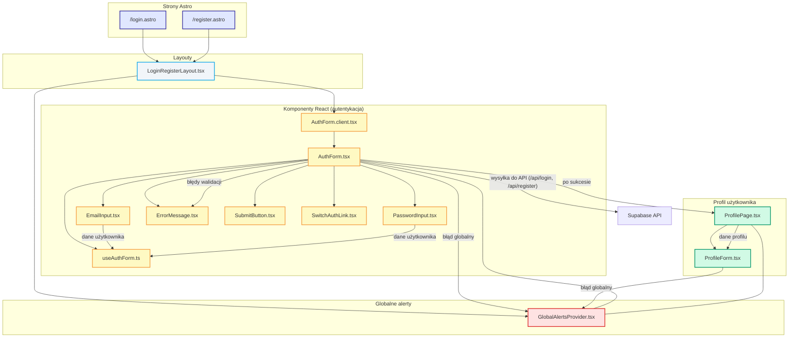

<architecture_analysis>
1. **Wszystkie komponenty związane z autentykacją:**
   - Strony Astro: `/login.astro`, `/register.astro`
   - Layout: `LoginRegisterLayout.tsx`
   - Komponenty React:
     - `AuthForm.client.tsx` (eksportuje `AuthForm.tsx`)
     - `AuthForm.tsx` (główny formularz logowania/rejestracji)
     - `EmailInput.tsx`, `PasswordInput.tsx` (pola formularza z walidacją)
     - `ErrorMessage.tsx` (wyświetlanie błędów)
     - `SubmitButton.tsx` (przycisk z obsługą ładowania)
     - `SwitchAuthLink.tsx` (przełączanie trybu logowanie/rejestracja)
     - `GlobalAlertsProvider.tsx` (globalny kontekst alertów)
     - Hook: `useAuthForm.ts` (logika formularza, walidacja, obsługa stanu)
   - Komponenty profilowe (po rejestracji): `ProfileForm.tsx`, `ProfilePage.tsx`

2. **Główne strony i odpowiadające komponenty:**
   - `/login.astro` i `/register.astro`:
     - Używają `LoginRegisterLayout`
     - Renderują `AuthForm.client` (w trybie login lub register)
     - Komponenty podrzędne: `EmailInput`, `PasswordInput`, `ErrorMessage`, `SubmitButton`, `SwitchAuthLink`
   - Po zalogowaniu: przekierowanie do `/` lub `/profile.astro` (gdzie używany jest `ProfilePage` i `ProfileForm`)

3. **Przepływ danych:**
   - Użytkownik wprowadza dane w `AuthForm` → walidacja przez `useAuthForm` → wysyłka do endpointu `/api/login` lub `/api/register`
   - Błędy walidacji wyświetlane inline (`ErrorMessage`)
   - Po sukcesie: przekierowanie do strony głównej/profilu
   - Globalne alerty obsługiwane przez `GlobalAlertsProvider`
   - Po rejestracji/logowaniu użytkownik uzupełnia profil (`ProfileForm`)

4. **Opis funkcjonalności komponentów:**
   - `AuthForm`: główny formularz logowania/rejestracji, obsługuje walidację, wysyłkę, przekierowania
   - `EmailInput`, `PasswordInput`: kontrolki z walidacją i obsługą błędów
   - `ErrorMessage`: wyświetlanie komunikatów błędów (inline/globalnie)
   - `SubmitButton`: przycisk z obsługą stanu ładowania
   - `SwitchAuthLink`: link do przełączania trybu logowanie/rejestracja
   - `LoginRegisterLayout`: layout dla stron autentykacji (logo, tło, sekcja formularza)
   - `GlobalAlertsProvider`: kontekst i UI do globalnych alertów (np. błąd logowania)
   - `useAuthForm`: hook do obsługi stanu formularza, walidacji, błędów
   - `ProfileForm`, `ProfilePage`: formularz i strona do uzupełniania profilu po rejestracji

**Dodatkowe zależności:**
- Komponenty korzystają z Tailwind, Shadcn/ui, React.
- Przepływ: Strona Astro → Layout → Komponent React (AuthForm) → Komponenty podrzędne → API/backend.
- Alerty i błędy obsługiwane zarówno lokalnie (inline), jak i globalnie (GlobalAlertsProvider).
</architecture_analysis>

<mermaid_diagram>

</mermaid_diagram>
